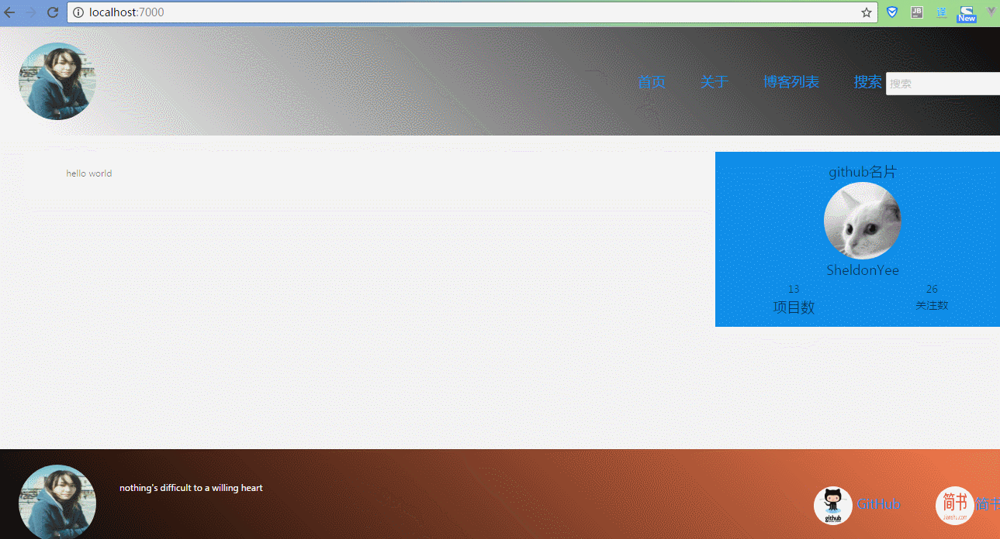

# Koa2.0重构pure-node-note-book

<h2>项目目的:深入学习Node，并且熟悉koa</h2>

<h2>项目介绍</h2>
<p>之前我已经使用了纯node去编写了一个博客，由于在平时的业务当中，我们不会使用一个纯手写一个web服务器，而是使用express或者koa等阵node.js的web服务器框架进行编写，因此出于个人喜好，本人选取了koa2.0进行编写。</p>      


<h2>技术栈</h2>

<h5>koa2.0 :流行node.js的web服务器框架</h5>

<h5>webpck : 自动化构建工具</h5>

<h5>babel ： 处理前端的ES6代码</h5>

<h5>ejs : ejs相对jade非常友好，因此选ejs作为模板语言用来做首屏渲染和SEO(搜索引擎优化)</h5>

<h5>es6: 采取ES6语法,由于chrome的V8引擎几乎完美支持ES6和部分ES7，因此在写Node的时候绝大部分采取ES6风格代码</h5>

<h5>react ：优秀前端框架</h5>

<h5>ant.design ： 优秀react UI库</h5>

<h5>SCSS : css预处理语言处理前端样式</h5>

<h5>MongoDB : 非关系数据库</h5>

<h5>Mongoose : MongoDB的ORM，方便対数据库的CURD的操作</h5>

---------------------------------------------------------------------------------------------------------------------------

<h2>效果图</h2>



<h2>介绍中间件:</h2>

1.static-server：主要是处理img，css，js等静态资源。

2.api-server:处理前端发送过来ajax请求，当前端将请求发送过来，通过报文的主要信息使用mongoose这个Promise风格的库操作mongoDB数据库，然后返回数据

3.cookie-parser:由于HTTP协议是无状态协议，当我们需要和客户端进行session的时候，我们需要cookie帮助我们保存状态，因此这个中间件，通过设置白名单机制来控制登录处理，用HttpOnly来方式XSS脚本注入攻击，用max-age来规定cookie保存时间

4.url-parser:这个中间件是用来处理前端通过post请求，通过流的方式，取得post请求的数据，然后将数据送到api-server中间件进行数据库处理

5.view-server:这个中间件主要负责服务端渲染，使用ejs模板语言根据URI来做出不同渲染，而且还处理了重定向的问题

```
步骤:
1.先安装mongoDB数据库

2.git clone git@github.com:PeterCheng1/pure-node-note-book.git

3.npm install

4.sh ./db.sh （启动mongoDB服务）

5. 进到public目录 ==> npm start (编译前端代码)

6. 在node启动目录，npm start 启动服务器 localhost:7000

```

[详细:pure-node-note-book](https://github.com/PeterCheng1/pure-node-note-book)